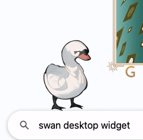

# 🦢 **Johan de Witt Swan Widget**  
*A desktop companion that squishes, quacks, and judges your life choices.*  

## **Features:**  
✅ **Squish Factor™** – Click him, and he compresses like a virtual stress-relief rubber duck. Double click and he quacks.  
✅ **Speech Bubble System** – He has **historically accurate sass**, and he *remembers* if you click too much.  
✅ **Dragging Complaints** – Move him around, and he will **vocally object** to being kidnapped.  
✅ **Idle Animations & Speech** – He subtly floats and **comments on your workflow—or lack thereof.**  
✅ **Stroopwafel Feeding** – Drag and drop his favorite snack (limited daily for *historical realism*).   
✅ **Right-Click Menu** – Functional actions like feeding, resigning (*closing*), and capturing the screen.  

---

### **Future Plans (v2.0 & Beyond):**  
🚀 **Actual automation features** – Clipboard history, file renaming, quick commands  
🚀 **More interactivity** – Reactions based on time, mood tracking, notifications  
🚀 **Smoother animations & expanded quote pool**  
🚀 **Potential AI-powered OCR/Translation integration**  

---

### **Installation & Setup:**  
1️⃣ Install Python 3.9+
2️⃣ Install PyQt6 → pip install PyQt6
3️⃣ Download the repo
4️⃣ Run: python swan.py
5️⃣ Enjoy being judged by a 17th-century statesman.

---

### **📢 Feedback & Bug Reports**  
**Please report any bugs if you find them!** If Johan glitches out, gets stuck, or refuses to be properly squishable, let me know.  
**Any feedback is welcome!** If you have ideas for **new features, quotes, or interactions**, I’d love to hear them.  
**More Johan = More Fun.** *Or more historical suffering. Either way, improvement.*  

